<p align="center">

<h3 align="center">BankApp</h3>
<p align="center"> </p>
</p>

### Database configuration
* Database name: bank
* In "backend/src/main/resources/application.properties", change MySQL user and pass

### How to run
#### Backend
1) Download the zip or clone the Git repository
2) Unzip the zip file
3) Open Command Prompt and Change directory (cd) to folder containing pom.xml
4) Open Eclipse
5) File -> Import -> Existing Maven Project -> Navigate to the folder where you unzipped the zip
6) Select the right project
7) Choose the Spring Boot Application file (search for @SpringBootApplication)
8) Right Click on the file and Run as Java Application

### FrontEnd
```
cd frontend
npm i
ng serve -o
```

### User account
```
USER: admin@email.com
PASS: 123456
```

### Screenshots

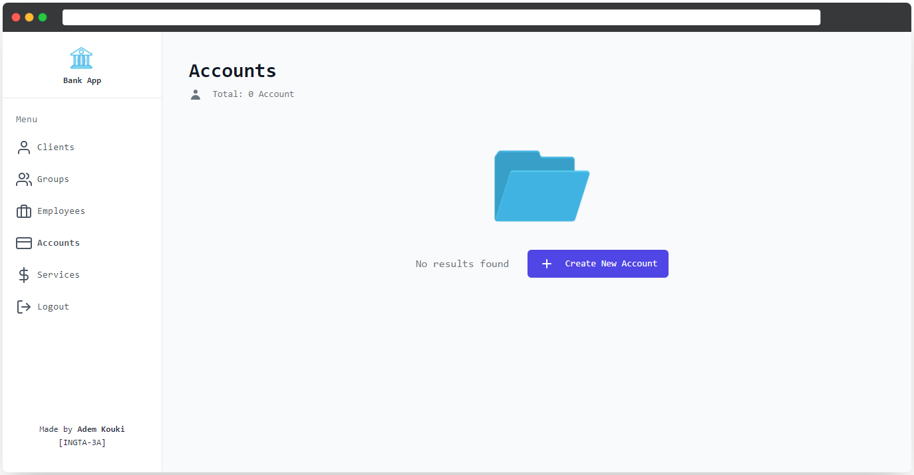
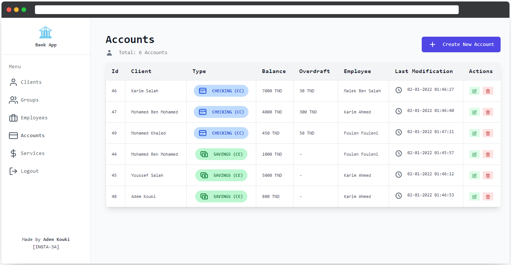
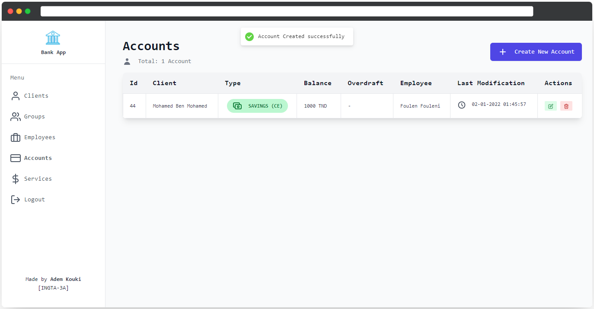

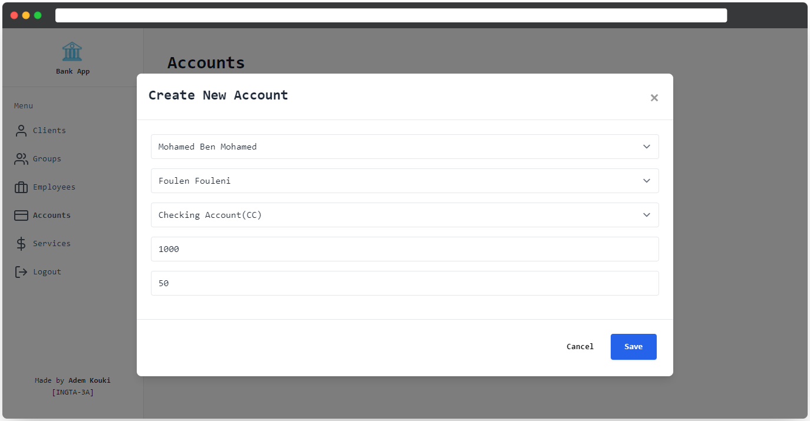
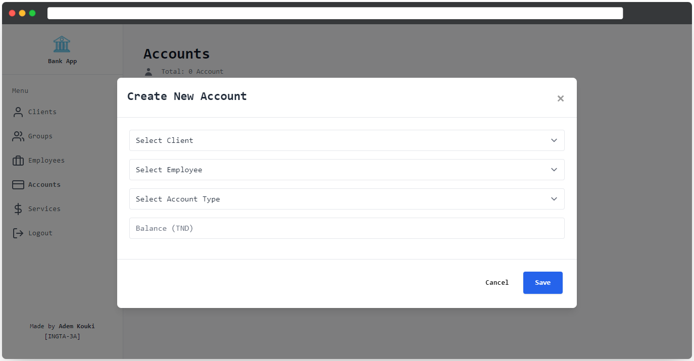
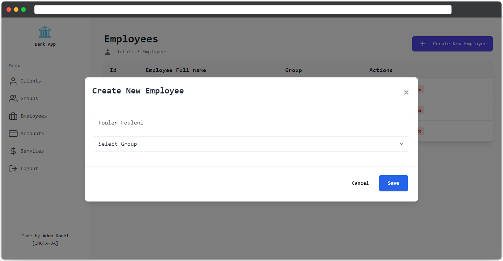
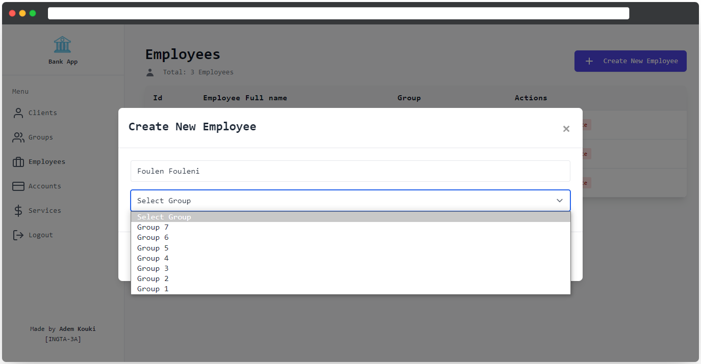
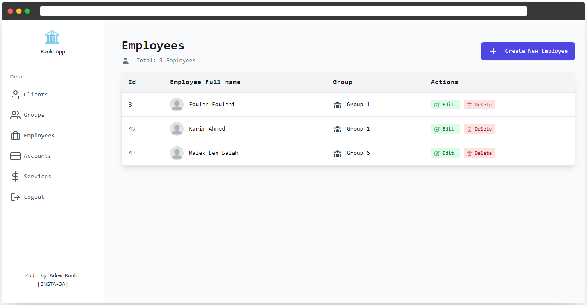
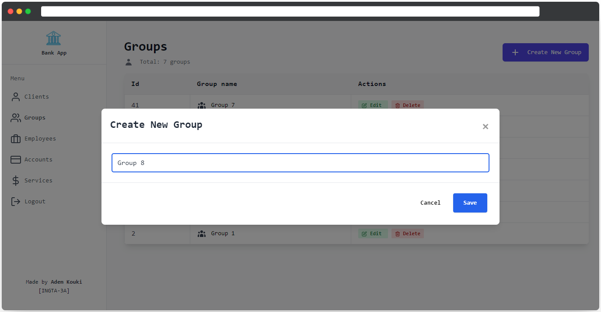
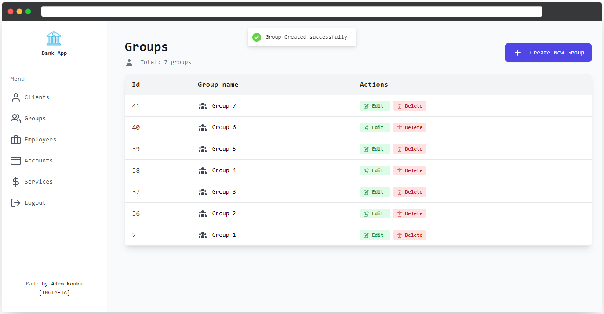
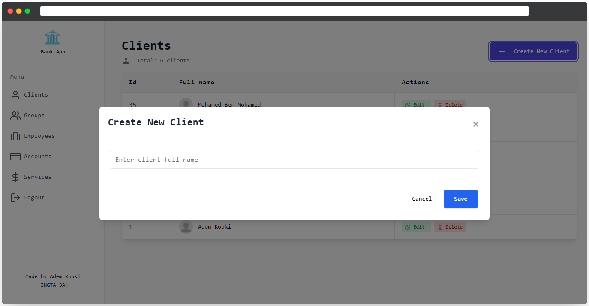
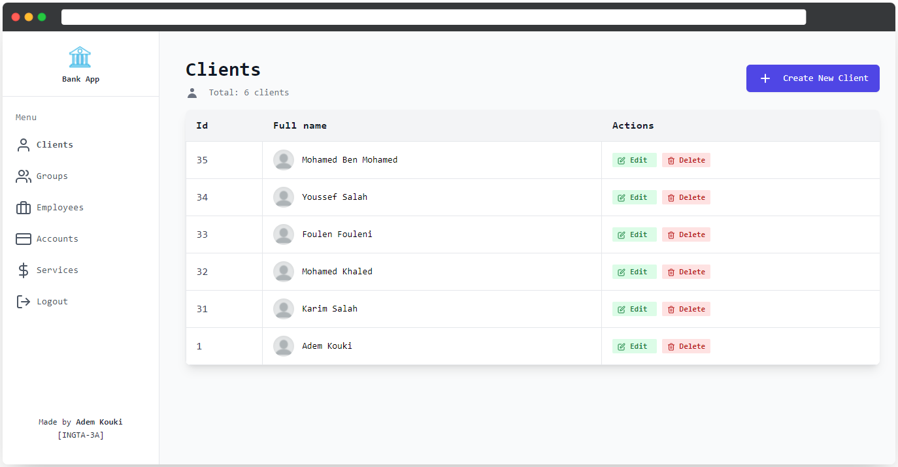
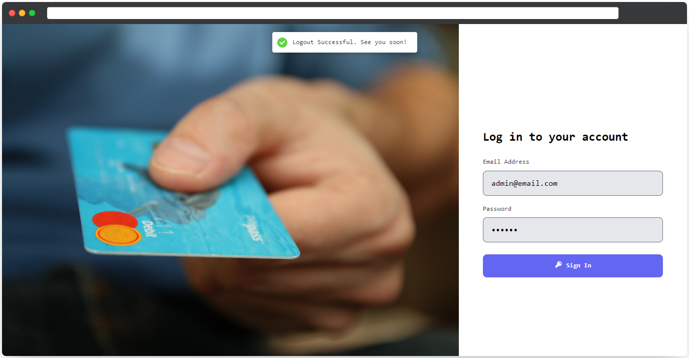
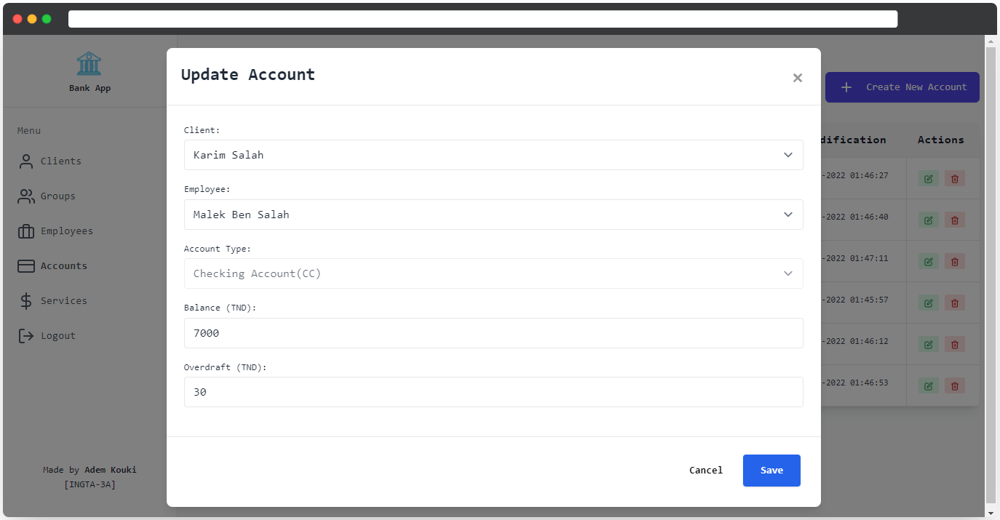
